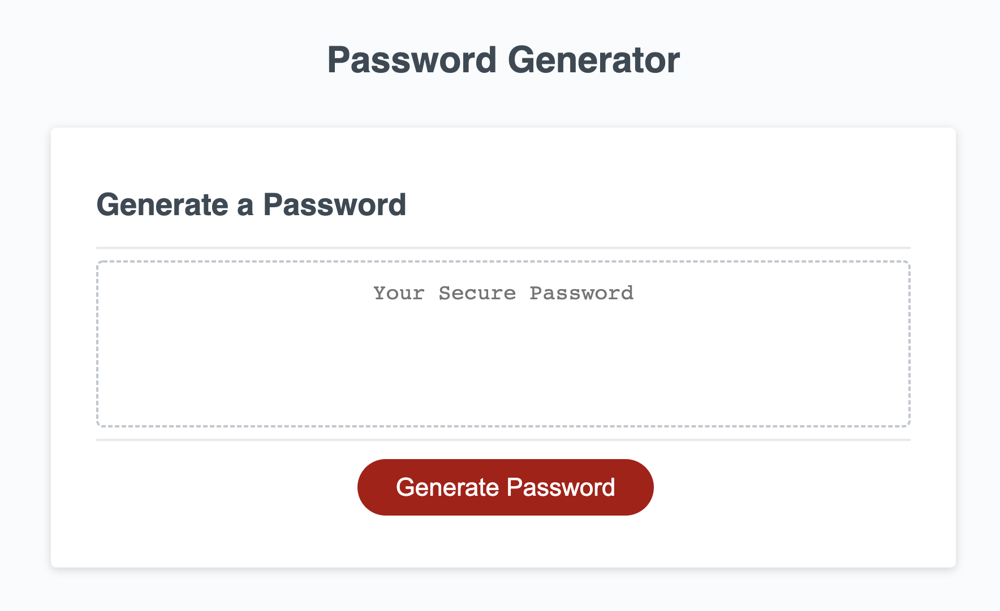
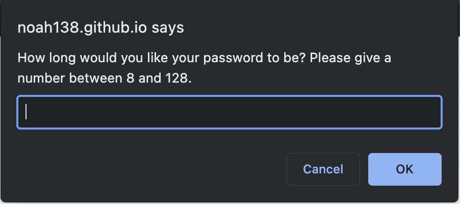
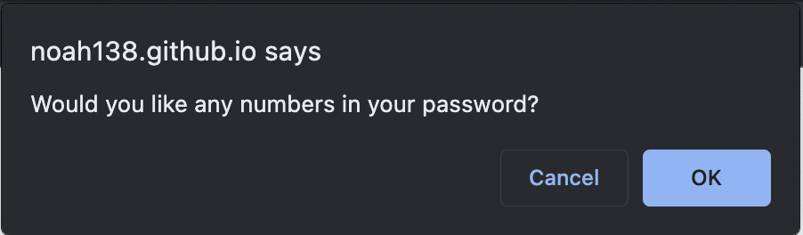
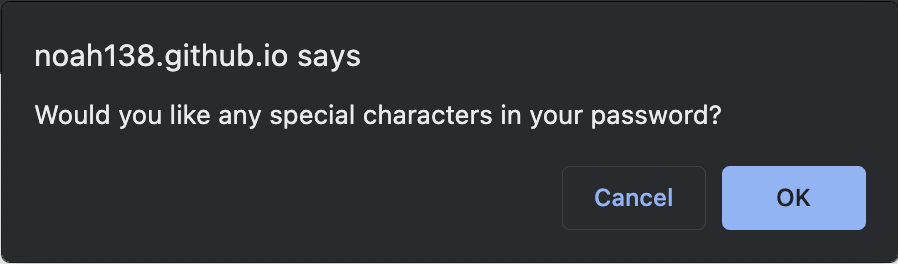
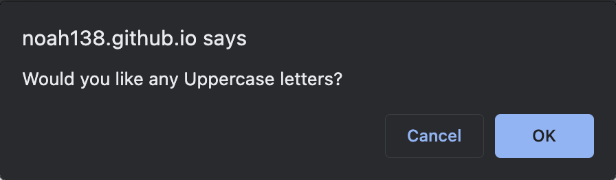
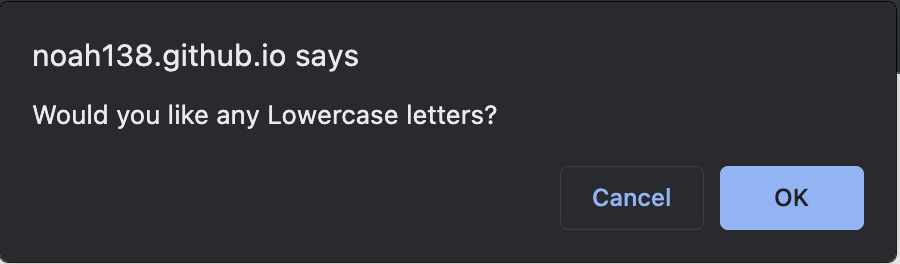
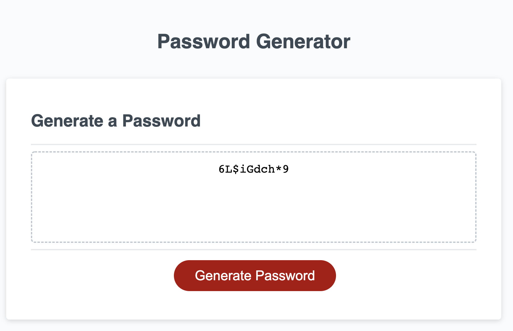

# module 3 challenge

# <Password Generator>

## Description

The goal of this project was to create an application that enabled employees to generate random passwords based on criteria they select. The criteria presented to the employee includes choosing a length between 8 and 128 characters for the password, and whether or not to include lowercase, uppercase, numeric, and/or special characters. When all the prompts are answered, a password is that matches the selected criteria is displayed on the webpage.

## Installation

N/A

## Usage

Link to view the deployed application: https://noah138.github.io/password-generator

To initiate the password generator, first click on the "Generator Password" button

Next, an alert will pop up prompting you to choose a password length between 8 and 128 characters. Enter a number between 8 and 128 and click "OK".

The next four alerts ask whether or not to include lowercase, uppercase, numeric, and/or special characters in the password. Click on "OK" to include the parameter, or "Cancel" to not include the parameter

After the selections have been made a randomly generated password meeting the criteria previously selected will be displayed in the box under "Generate Password"

## Credits

The beautiful team of instructors at the UW Full-Time Online Coding Boot 2022

## License

Please refer to the liscense in the repo.